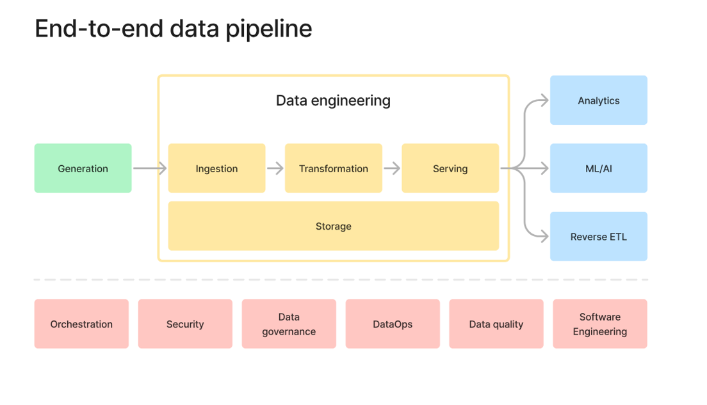
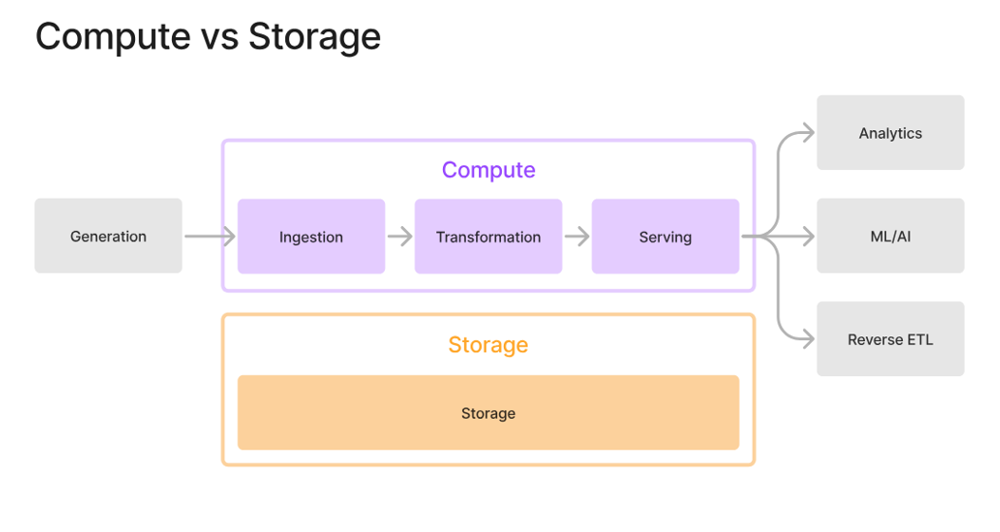
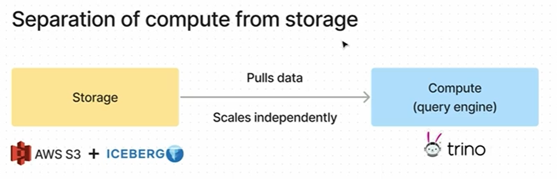

## Data Engineering

Data engineering is the discipline of building and operating the pipelines, storage, and tooling that turn raw data into reliable, usable data for analytics, reporting, and AI/ML. In plain English: data engineers make sure data gets collected, cleaned, transformed, moved, and made available in the right place, in the right format, at the right time.

#### `Compute vs Storage` in Data Engineerng

In data engineering:

- Compute = the processing power that does work on data
- Storage = the place where data lives and is retained

#### Data Maturity
Data maturity is the degree to which data is governed, automated, trusted, and scalable across the full data lifecycle.

A practical maturity view looks like this:

- Level 1: Ad hoc - Data is manual, inconsistent, and managed in spreadsheets or one-off scripts.
- Level 2: Repeatable - Some pipelines and standards exist, but they’re still fragile and heavily human-dependent.
- Level 3: Defined - Core data flows are standardized, documented, and governed.
- Level 4: Managed - Data quality, lineage, monitoring, and SLAs are in place.
- Level 5: Optimized - The platform is automated, scalable, cost-aware, and continuously improved.

In data engineering terms, maturity typically shows up in a few dimensions:

1. Ingestion: manual loads vs automated pipelines
2. Transformation: one-off SQL vs reusable, tested data models
3. Storage: scattered files vs curated lakehouse/warehouse architecture
4. Data quality: no checks vs systematic validation and alerts
5. Governance: unclear ownership vs defined stewardship, catalog, and access controls
6. Operations: reactive firefighting vs monitoring, observability, and incident management
7. Consumption: isolated reports vs trusted data products serving analytics and ML