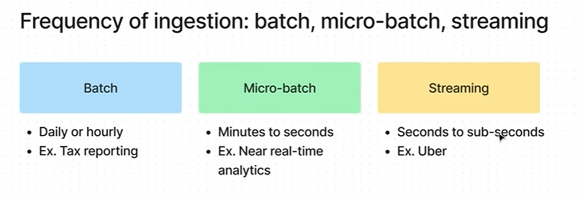

# Ingestion in Data Pipelines

> Ingestion is the process of bringing data from source systems into a pipeline's storage or processing environment so it can be cleaned, transformed, analyzed, or served downstream.

---

## Types of ingestion

| Type | Frequency | Latency | Typical use |
|---|---:|---:|---|
| Batch | Scheduled | High | Reporting, historical loads |
| Micro-batch | Frequent small intervals | Medium | Near-real-time dashboards |
| Streaming | Continuous | Low | Real-time analytics, alerts |

---

## ETL vs ELT

Two main pipeline patterns:

### ETL — Extract, Transform, Load

- Extract data from source systems
- Transform it before loading
- Load cleaned/structured data into the target system

Best for:

- strict data quality requirements
- legacy warehouses
- heavy transformation before storage
- most batch ingestion pipelines

### ELT — Extract, Load, Transform

- Extract data from sources
- Load raw data first into storage
- Transform later inside the storage/compute platform

Best for:

- data lakes and lakehouses
- large-scale cloud platforms
- flexible schema and late transformation needs
- many streaming or modern cloud-native pipelines

---

## Quick comparison

| Pattern | Order | Where transformation happens | Best fit |
|---|---|---|---|
| ETL | Extract → Transform → Load | Before loading | Warehouses, controlled data pipelines |
| ELT | Extract → Load → Transform | After loading | Data lakes, lakehouses, cloud analytics |

---

## Typical ingestion architecture (conceptual)

Source systems (DBs, APIs, Files, Kafka)

→ Connectors / Custom code / Streaming ingestion

→ Data platform (Databricks / Snowflake / BigQuery / Redshift)

→ Bronze layer (raw landing zone)

This is commonly layered into Bronze → Silver → Gold depending on transformations and usage.

---

## Common connectors & tooling by scenario

| Scenario | Preferred approach / tools |
|---|---|
| MySQL → Databricks | Airbyte / Fivetran / JDBC |
| MySQL → Snowflake | Fivetran / Snowpipe / JDBC |
| CSV in S3 → Databricks | Auto Loader |
| CSV in S3 → Snowflake | Snowpipe |
| Kafka → Databricks | Spark Structured Streaming |
| Kafka → Snowflake | Kafka Connectors |
| REST API → Databricks | Python (requests) + scheduled jobs |
| REST API → Snowflake | Python/ETL tool to stage files then load |

General note: Being on the same cloud provider can simplify tooling (cloud-native services), but ingestion is still required.

---

## Cloud-native examples

| Source | Destination | Common tool |
|---|---|---|
| RDS PostgreSQL | Redshift | AWS DMS, AWS Glue |
| Azure SQL | Synapse | Azure Data Factory |
| Cloud SQL | BigQuery | Dataflow, Datastream |

---

## Example ingestion patterns

### 1) Airbyte → Databricks

MySQL → Airbyte (extract) → Databricks Bronze

Airbyte runs extraction using its compute and writes to the lakehouse.

### 2) Databricks notebook (PySpark)

MySQL → PySpark notebook (Databricks compute) → Bronze table

Databricks provides the compute for extraction and write.

### 3) Orchestration (Airflow / GitHub Actions)

Code stored in Git repository

→ Airflow server (or GitHub runner) executes Python script

→ Script interacts with Databricks / target platform

Notes:

- Git is for storage/versioning; execution happens on Airflow servers, runners, or cloud compute.
- Runners/servers provide CPU/RAM and network to run the ingestion jobs.

### 4) Cloud file ingestion (S3 → Auto Loader → Bronze)

S3 → Auto Loader → Bronze (Databricks notebook processes data)

### 5) SaaS connector (Salesforce → Databricks)

Often mostly configuration; minimal custom code required when supported by connectors.

---

## Practical guidance

- Choose connectors when possible (Airbyte, Fivetran, cloud-native connectors) to reduce maintenance.
- Use ELT for large-scale, flexible platforms (lakehouses), and ETL when transformations must run before storage.
- Use streaming (Spark Structured Streaming, Kafka Connect) for low-latency needs.
- Stage raw data (bronze) to enable reprocessing and reproducibility.
- Automate orchestration (Airflow, Prefect, DAGs) and treat pipelines as code (store in Git).

---

## FAQ

**Q: Can Airbyte be deployed in our own cloud?**

**A:** Yes. Airbyte supports both managed cloud and self-hosted deployments. Many enterprises self-host Airbyte on AWS, Azure, or GCP for security and compliance reasons, controlling compute, networking, and data movement while keeping data within their cloud environment.

---

## References & next steps

- Evaluate connector coverage for your sources (Airbyte, Fivetran, cloud connectors).
- Decide ETL vs ELT based on data quality, latency, and platform capabilities.
- Prototype one ingestion flow (e.g., MySQL → Bronze) and verify schema/partitioning and retry/recovery behavior.
