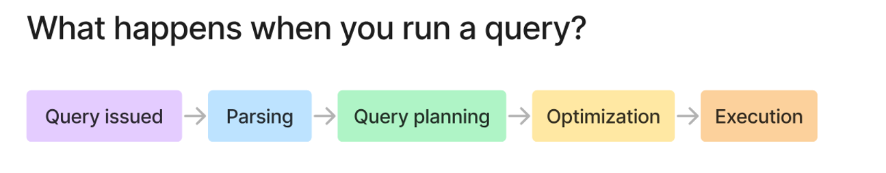
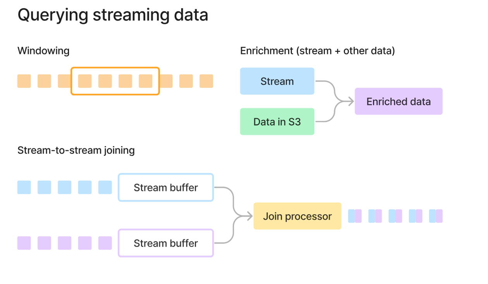

# Transformation in Data Pipelines

The transformation step takes raw data extracted from source systems and cleans, reshapes, enriches, and validates it so it becomes fit for analysis or for loading into a target system.

---

## 1) Data cleaning

- Remove duplicates and handle null/missing values
- Fix formatting inconsistencies (dates, casing, trimming whitespace)
- Correct invalid or out-of-range values
- Standardize units (currencies, measurements)
- Normalize text (unicode, punctuation)

---

## 2) Structuring & reshaping

- Pivot / unpivot (rows ↔ columns)
- Flatten nested structures (JSON arrays → relational rows)
- Split or merge columns (e.g., `FullName` → `FirstName`, `LastName`)
- Transpose or aggregate (daily → monthly summaries)

---

## 3) Data type conversion

- Cast strings → integers, floats, dates, booleans
- Parse timestamps into date/time components
- Encode categorical variables (label / one-hot)

---

## 4) Business logic & derived columns

- Apply formulas and rules (profit margin, tax)
- Derive columns (age from birthdate)
- Flag records by condition (high-value customers, churn risk)

---

## 5) Integration & enrichment

- Join data from multiple sources (orders + customers)
- Lookup reference tables (ZIP → region)
- Add external data (weather, exchange rates)
- Use caches for low-latency enrichment (Redis)

---

## 6) Filtering & subsetting

- Drop irrelevant records/columns
- Apply date ranges or category filters
- Sample data for tests or model training

---

## 7) Aggregation & summarization

- GROUP BY: sum, count, avg, min, max
- Windowing: rolling windows, running totals
- Compute KPIs and metrics (DAU, revenue, conversion rate)

---

## 8) Data validation

- Schema validation (columns, types, nullability)
- Referential integrity checks (foreign key consistency)
- Business rule validation (e.g., `end_date` > `start_date`)
- Row counts, value ranges, anomaly detection

---

## What happens when you run a query in Spark?

1. Query issued
   - You create a SQL query or DataFrame operations (`.filter()`, `.groupBy()`, `.join()`).
   - Spark uses lazy evaluation: it records the transformations but does not execute them.

2. Parsing
   - SQL is parsed into an Unresolved Logical Plan (ANTLR builds an AST).
   - Syntax is checked; table/column names remain unresolved at this stage.

3. Query planning (Catalyst Optimizer)
   - Analysis: resolves table/column names using the Catalog → Resolved Logical Plan.
   - Logical optimization: rule-based transforms (predicate pushdown, constant folding, column pruning).
   - Physical planning: produce possible physical plans (e.g., SortMergeJoin vs BroadcastHashJoin).

4. Optimization & code gen
   - Cost-Based Optimizer (CBO) selects the best physical plan using statistics.
   - Tungsten optimizes memory layout and binary processing.
   - Whole-stage code generation compiles operators into JVM bytecode for speed.
   - Decisions include partitioning, shuffle boundaries, and broadcast thresholds.

5. Execution
   - Physical plan → DAG (Directed Acyclic Graph) of stages.
   - Stages split at shuffle boundaries; each stage contains many tasks.
   - Tasks run on executors: data is read, transformed, shuffled, and written.
   - Actions (`.show()`, `.count()`, `.write()`) trigger execution.

---

## Streaming transformations: patterns & techniques

### Windowing

- Streams are unbounded; aggregate over windows (time slices).
- Types of windows:
  - Tumbling: fixed, non-overlapping (every 5 minutes)
  - Sliding: overlapping windows (size 5 min, slide 1 min)
  - Session: grouped by inactivity gap
- Example: count orders per 10-minute tumbling window.

### Enrichment (stream + static data)

- Join streaming events with reference/static data (S3, DB, cached tables).
- Typical flow: event with `user_id` → enrich with profile data → emit enriched event.
- Sources for enrichment: S3 (CSV/Parquet), DB lookups, Redis cache.

### Stream-to-stream joins

- Join two live streams on a key within a time-bound window.
- Buffering is required; define watermarks to bound state and drop late unmatched events.
- Example: match orders stream with payments stream within 30 seconds.

Summary table:

- Windowing: 1 stream → aggregate over time slices
- Enrichment: stream + static data → add context
- Stream-to-stream join: 2 streams → correlate events

---

## Data modelling techniques (overview)

1. Conceptual modelling — business-level entities and relationships (ER, UML).
2. Logical modelling — attributes, keys, relationships; database-agnostic.
3. Physical modelling — tables, indexes, partitions, types; DB-specific.
4. Relational modelling — normalized tables (OLTP).
5. Dimensional modelling (Star / Snowflake) — analytics & BI (fact + dims).
6. Data Vault — hubs, links, satellites for auditability and history.
7. Document modelling — JSON/BSON for flexible schema (MongoDB).
8. Graph modelling — nodes & edges for highly connected data (Neo4j).
9. Time-series modelling — optimized for sequential timestamped data (InfluxDB).
10. Hierarchical & Object-oriented modelling — domain-specific use cases.

---

## Quick comparisons

### Modelling choice by use case

- OLTP / transactions → Relational (Postgres, MySQL)
- Analytics / BI → Dimensional (Redshift, BigQuery)
- Enterprise DWH / auditing → Data Vault + dbt
- Flexible documents → MongoDB
- Highly connected data → Graph DB (Neo4j)
- Time-series → InfluxDB / TimescaleDB

### Tool comparison (summary)

| Tool | Scale | Type | Skill needed | Best for |
|---|---:|---|---|---|
| dbt | Medium–Large | SQL/ELT | SQL | Warehouse transformations, analytics engineering |
| Spark | Very Large | Batch/Stream | Python/Scala | Big data processing |
| Flink | Very Large | Streaming | Java/Python | Real-time streaming pipelines |
| AWS Glue | Large | Serverless ETL | PySpark | AWS ecosystem transformations |
| Azure Data Factory | Large | Low-code ETL | GUI / SQL | Azure ecosystem, hybrid pipelines |
| Dataflow | Large | Managed Beam | Python/Java | GCP streaming & batch |
| Pandas | Small–Medium | In-memory | Python | Data science, local processing |
| Polars | Medium–Large | In-memory | Python/Rust | Fast local/ETL processing |
| Matillion / Informatica | Medium–Large | Low-code | GUI | Enterprise ETL / ELT |

---

## How to choose a transformation tool

- Need SQL-first warehouse transforms? → dbt / SQLMesh
- Big data batch processing? → Apache Spark
- Real-time streaming? → Flink / Kafka Streams
- Cloud-specific managed offerings? → AWS Glue / ADF / Dataflow
- Small/medium Python work? → Pandas / Polars
- Enterprise GUI preference? → Informatica / Matillion

Modern trend: ELT — load raw data into the warehouse, then transform using dbt or in-warehouse compute.

---

## Next steps / checklist

- Identify critical sources and required SLAs (latency, freshness).
- Choose modelling approach per subsystem (dimensional for analytics, relational for OLTP).
- Prototype a transform job (dbt model or Spark job) and validate schema & metrics.
- Add monitoring, data quality checks, and retry/recovery flows.

